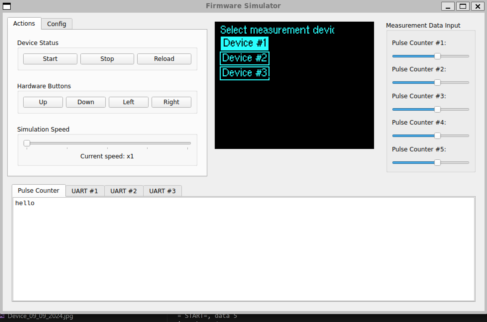
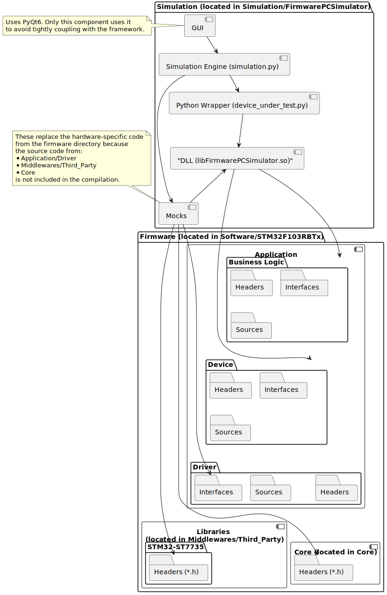

# PC Simulator for firmware

## Why using a simulator?

The reasons for using a simulator are explained in the [main README](../README.md).



## Architecture



Simulation consists of:
- Firmware (.so file)
  - High-level logic is used as-is, without modification for simulation mode. This code is located in the [Application/BusinessLogic/](../Software/STM32F103RBTx/Application/BusinessLogic) and [Application/Device/](../Software/STM32F103RBTx/Application/Device) folders within the firmware directory.
  - The [Stub folder](./Stub) replaces low-level classes (Driver folder within the firmware directory).
- device_under_test.py: Loads the firmware .so file and provides a Python API interface.
- simulation.py: Main simulation class. It contains a thread that periodically calls tick from the library, retrieves - internal states like the content of the LCD, and sets external events such as simulating button presses to the firmware.
main_window.py: Main window of the application.
- main.py: Provides the graphical interface.

### Remarks

* Do Not Inherit from [Firmware Driver Headers](../Software/STM32F103RBTx/Application/Driver), as they include many HAL dependencies that are difficult to stub and not needed in simulation mode. Instead, use driver interface headers and create stub drivers based on inheritance from those interfaces. The only exception to this rule is the Display driver.

* No Stubs for [Business Logic](../Software/STM32F103RBTx/Application/BusinessLogic) or [Device](../Software/STM32F103RBTx/Application/Device) Layers. A stub in these layers suggests the classes are too tightly coupled with low-level code, indicating a need to refactor the firmware for better separation of concerns.

## Toolchain

* Python3
* PyQT6
* C++
* cmake
* Docker

## Setup

## Prerequisites

* [Install Docker.](./SetupDockerContainer.md)


## Setting up the Windows Environment (Host)

### Summary

This is a GUI application, not a CLI, so extra setup is required on Windows.

Steps:
  * Install WSL
  * Install Alpine Linux distro (it's a very small distro).
  * Configure Alpine within Docker Desktop settings.
  * Install the VS Code WSL extension.
  * Launch the container via the WSL terminal to enable display support.


### Install WSL

Open PowerShell as Administrator and run the following command:

```
wsl --install
wsl --set-default-version 2
```

### Install Alpine

  * Open the Microsoft Store on Windows.
  * Search for "Alpine WSL".
  * Click Get or Install.
  * Once installed, open the "Alpine" app from your Start menu. It will open a terminal and complete the setup.
  * Set your username and password when prompted.

### Configure Alpine within Docker Desktop settings.

  * Open Docker Desktop on Windows.
  * Go to Settings (gear icon) > Resources > WSL Integration.
  * Toggle the switch for Alpine to ON.
  * Click Apply & Restart.

### Install the VS Code WSL extension.

  * In VS Code install the WSL extension (by Microsoft).
  * To connect: Click the blue "Open a Remote Window" icon in the bottom-left corner and select "Connect to WSL using Distro...", then choose Alpine.

### Result

You should be able to launch WSL terminal as one of options in terminal selection in VS Code.


## Setting up the Linux Environment (Host)

```
xhost +local:docker
```

## Build and Start the Simulation

```
cd /workspace/build/ && cmake .. && make -j24 && cd /workspace/Simulation/FirmwarePCSimulator/ && /workspace/venv/bin/python3 main.py
 ```

### Troubleshooting tunneling GUI to host environment

Run:

```
xclock
```

If a small window with a clock is visible, it means everything is set up correctly.

### Troubleshooting crashes

[Install Docker.](../IntegrationTest/README.md)
