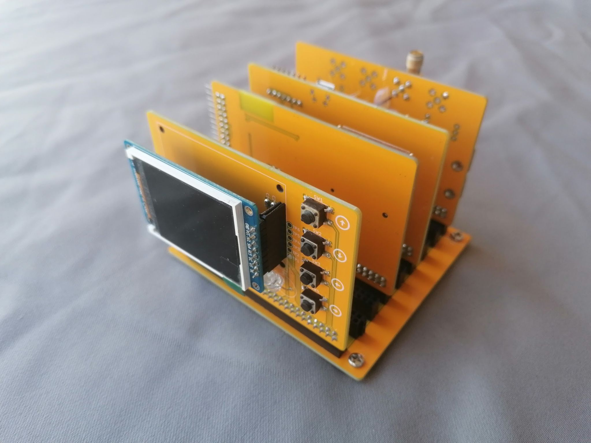
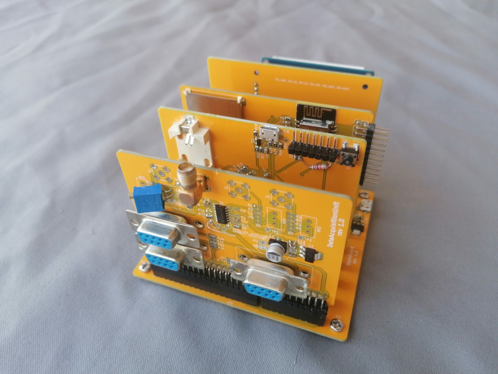

# HardwareDataLogger

   
## Summary

**_TL;DR It can collect, display, and store data locally and remotely, interfacing with various other devices._**

This is a modular, low-cost hardware data logger that can be easily extended or modified by changing the cards connected to it. The idea is that instead of reworking or changing the entire concept, only some cards need to be replaced, making it more reusable.

The project is based on:

* **STM32F103RBTx:** The main component, responsible for data processing.
* **ESP32-WROOM-32E:** For sending data to external nodes (e.g., Raspberry Pi).
* Software on a **remote node (Raspberry Pi):** Stores the data, processes it further, and provides a web interface with measurements for the user.

This project has the following features:

* **Pulse counting** from up to four devices (e.g., Geiger counters) with logic levels from 3.3V to 16V, using SMA connectors.
* **Data acquisition from measurement devices via UART**, utilizing a DB9 connector.
* User interface with a ***128x160 RGB LCD, four navigation buttons*** (up/down/left/right), and automatic LCD dimming in low light.
* UART over USB for transferring logged data to an external PC.
* ***microSD*** card for permanent data storage.
* ***WiFi*** capability for remote data transfer.

## Software

#### STM32F103RBTx Board
The STM32F103RBTx serves as the main microcontroller, handling data acquisition, processing, serialization, and user interaction.

* Toolchain: C++20, C, STM32 VS Code Extension, CMake.
* [More info.](./Software/STM32F103RBTx/README.md)

#### ESP32WROOM32E
The ESP32WROOM32E is only used for data transfer via WiFi; in the future, it will support FOTA (Firmware Over-The-Air).

* Toolchain: Rust.
* [More info.](./Software/ESP32WROOM32E/README.md)

## DevOps

It's good to let the machine handle the tedious work of checking code quality, freeing up more time for the useful and interesting parts of software development.

* Toolchain: Unit tests (Google Test, Google Mock), code coverage (LCOV), static code analysis (CodeChecker, prospector), Docker (for both local development and CI), GitHub Actions (CI).

[Info on how to build the image and use the environment for development](./DevOps/README.md). Note that Simulation and Integration Tests (see below) have their own READMEs explaining usage, but they still use the common Docker image.

## Hardware

Due to the availability of low-cost, high-quality PCB manufacturing, home-etched PCBs have become largely obsolete. While the PCB design for this project may be difficult to etch at home, it is still possible. [Subparts of the circuit can be assembled on a breadboard, making the process much easier](./Documentation/Pictures/Device_30_08_2021.jpg), and the modular software design allows for easy reuse of these components.

* Toolchain: KiCad
* Circuit exported to .pdf is available here (there are many PCBs due to modular design):
  
    * [DataAcquisitionUnit](./Hardware/DataAcquisitionUnit/README.md)
    * [DataProcessingUnit](./Hardware/DataProcessingUnit/README.md)
    * [HumanMachineInterface](./Hardware/HumanMachineInterface/README.md)
    * [MainBoard](./Hardware/MainBoard/README.md)
    * [ProcessingAndStorage](./Hardware/ProcessingAndStorage/README.md)

## Simulation

Embedded development is cool, but constantly flashing the target device for non-hardware-related logic, like the human-machine interface, can be time-consuming and frustrating. To streamline this, a simulation was developed that isolates the firmware not directly tied to hardware, adds stubs for drivers, and includes a GUI. This allows all high-level aspects, such as what’s displayed on the LCD, user interaction via buttons, and data parsing, to be tested without the need for hardware.

While this simulation handles the firmware, speed of execution isn't a concern since it focuses solely on high-level logic. For hardware or driver-related issues, traditional methods like using an oscilloscope or logic analyzer are still necessary, as the simulation cannot be used.

* Toolchain: pyqt6, cmake.
* [More info.](./FirmwarePCSimulator/README.md)

## Integration Tests (Software in the Loop)

Unit tests are good (they are used in this project as well, along with code coverage), but they don't test the software as a whole. This is especially important here where there are multiple nodes (STM32, ESP8266, remote host). To fill this gap, fully automated integration tests were added.

* Toolchain: pytest, cmake.
* [More info.](./IntegrationTest/README.md)
