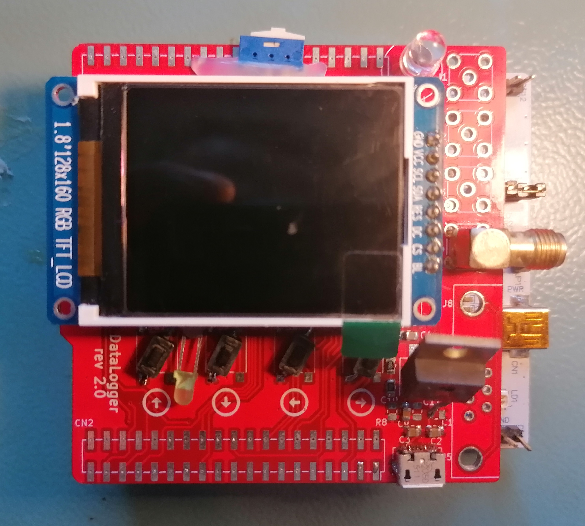

# HardwareDataLogger

## Summary

**_TL;DR It can collect, display, and store data locally and remotely, interfacing with various other devices._**

This project realizes a shield for the STM32F103RBTx with the following features:

* Pulse counting from up to four devices (e.g., Geiger counters) with logic levels from 3.3V to 16V, using SMA connectors.
* Data acquisition from measurement devices via UART, utilizing a DB9 connector.
* User interface with a 128x160 RGB LCD, four navigation buttons (up/down/left/right), and automatic LCD dimming in low light.
* UART over USB for transferring logged data to an external PC.
* microSD card for permanent data storage.
* WiFi capability for remote data transfer.

## Software

#### STM32F103RBTx Board
The STM32F103RBTx serves as the main microcontroller, handling data acquisition, processing, storage, and user interaction.

* Toolchain: C++17, C, STM32 VS Code Extension, CMake.
* [More info.](./Software/STM32F103RBTx/README.md)

#### ESP8266
The ESP8266 is currently used for data transfer via WiFi and will support FOTA (Firmware Over-The-Air) in the future.

* Toolchain: TBD, currently using Arduino IDE.
* [More info.](./Software/ESP8266MOD/README.md)

#### DevOps

It's good to let the machine handle the tedious work of checking code quality, freeing up more time for the useful and interesting parts of software development.

* Toolchain: Unit tests (Google Test, Google Mock), code coverage (LCOV), static code analysis (Cppcheck), dynamic code analysis (Valgrind), Docker (for both local development and CI), GitHub Actions (CI).

* [Info how to use Docker to build the project.](./DevOps/README.md)

## Hardware

Due to the availability of low-cost, high-quality PCB manufacturing, home-etched PCBs have become largely obsolete. While the PCB design for this project may be difficult to etch at home, it is still possible. [Subparts of the circuit can be assembled on a breadboard, making the process much easier](./Documentation/Pictures/Device_30_08_2021.jpg), and the modular software design allows for easy reuse of these components.

* [Circuit exported to .pdf is available here](./Documentation/Circuit/Logger.pdf)
* Toolchain: KiCad
* [More info.](./Hardware/Logger/README.md)

## Simulation

Embedded development is cool, but constantly flashing the target device for non-hardware-related logic, like the human-machine interface, can be time-consuming and frustrating. To streamline this, a simulation was developed that isolates the firmware not directly tied to hardware, adds stubs for drivers, and includes a GUI. This allows all high-level aspects, such as what’s displayed on the LCD, user interaction via buttons, and data parsing, to be tested without the need for hardware.

While this simulation handles the firmware, speed of execution isn't a concern since it focuses solely on high-level logic. For hardware or driver-related issues, traditional methods like using an oscilloscope or logic analyzer are still necessary, as the simulation cannot be used.

* Toolchain: pyqt6, cmake.
* [More info.](./Simulation/FirmwarePCSimulator/README.md)
