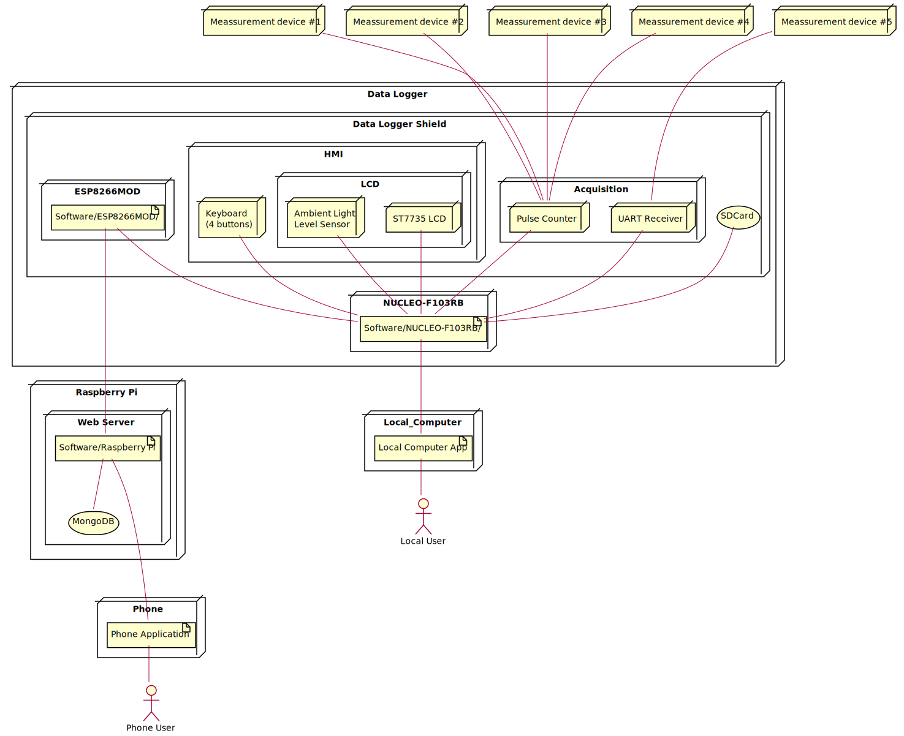
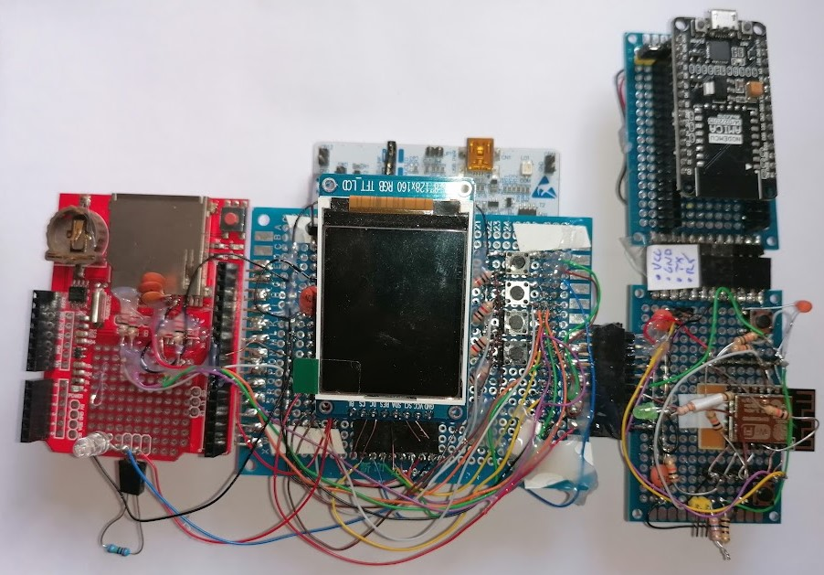

# HardwareDataLogger

 

## Summary

Data logging shield for NUCLEO-F103RB with following capabilities:
- pulse counting from four different devices
    - logic level from 3V3 to 16V
    - SMA connectors are used
- gathering data via UART
    - DB9 connector is used
- user interface
    - LCD 128*160 RGB
    - four push button to manipulate the GUI, standard layout of buttons - up/down/left/right
    - dimming LCD when it's getting dark
- UART over USB socket to transfer logged data
- microSD card to permanently save logged data
- WiFi to remotely transfer logged data.

## Architecture

## Hardware

[Circuit exported to .pdf is available here](./Documentation/Circuit/Logger.pdf), more [info can be found here](./Hardware/Logger/README.md).

Current version is visible below, it's for testing purpose, the final one will have custom designed PCB.

## Software

#### NUCLEO-F103RB
* Firmware for Nucleo board is being developed in C++.
* STM32CubeIDE was is used as IDE and as a tool for hardware peripherals configuration.
* [More info.](./Software/NUCLEO-F103RB/README.md)

## Simulation

PC Simulation of Firmware is being made using Python+Qt.

Details of [simulation are available here.](./Simulation/FirmwarePCSimulator/README.md)