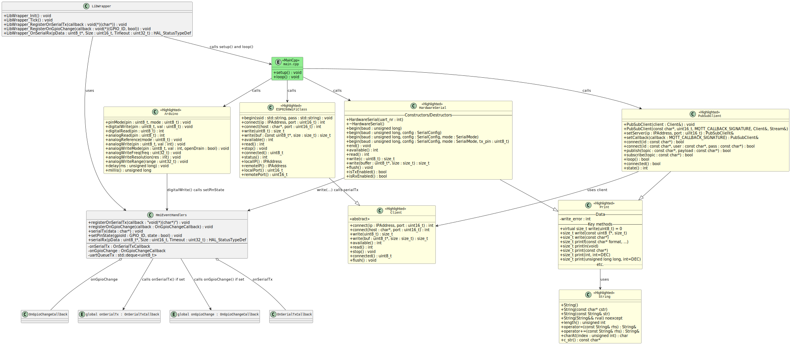

In yellow are mocked files from Arduino libraries, in green the emulated code, and in grey additional classes to provide an API for the simulation. The code is compiled into a .so library that is used by the GUI in Python.

