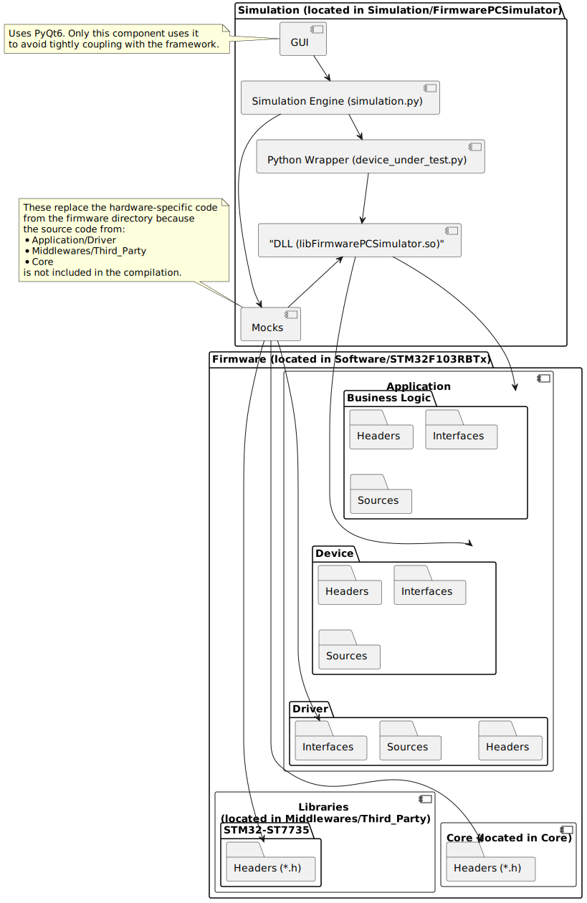

# PC Simulator for firmware

## Why using a simulator?

The reasons for using a simulator are explained in the [main README](../../README.md).


## Architecture



Simulation consists of:
- Firmware (.so file)
  - High-level logic is used as-is, without modification for simulation mode. This code is located in the [Application/BusinessLogic/](../../Software/STM32F103RBTx/Application/BusinessLogic) and [Application/Device/](../../Software/STM32F103RBTx/Application/Device) folders within the firmware directory.
  - The [Stub folder](./Stub) replaces low-level classes (Driver folder within the firmware directory).
- device_under_test.py: Loads the firmware .so file and provides a Python API interface.
- simulation.py: Main simulation class. It contains a thread that periodically calls tick from the library, retrieves - internal states like the content of the LCD, and sets external events such as simulating button presses to the firmware.
main_window.py: Main window of the application.
- main.py: Provides the graphical interface.

### Remarks

* Do Not Inherit from [Firmware Driver Headers](../Software/STM32F103RBTx/Application/Driver), as they include many HAL dependencies that are difficult to stub and not needed in simulation mode. Instead, use driver interface headers and create stub drivers based on inheritance from those interfaces. The only exception to this rule is the Display driver.

* No Stubs for [Business Logic](../../Software/STM32F103RBTx/Application/BusinessLogic) or [Device](../../Software/STM32F103RBTx/Application/Device) Layers. A stub in these layers suggests the classes are too tightly coupled with low-level code, indicating a need to refactor the firmware for better separation of concerns.

## Toolchain

* Python3
* PyQT6
* C++
* cmake
* Docker

## Setup

## Prerequisites

* [Install Docker and log into the container.](./SetupDockerContainer.md)


# Building and Running Firmware PC Simulation

When running docker container on Linux machine, allow docker to create windows

```
xhost +local:docker
```

### Build the Firmware (PC Variant)

```
cd /workspace/build/ && cmake .. && make -j24
```

### Start the Simulation

```
cd /workspace/build/ && cmake .. && make -j24 && cd /workspace/Simulation/FirmwarePCSimulator/ && /workspace/venv/bin/python3 main.py
 ```

### All-in-One Command

```
cd /workspace/build/ && cmake .. && make -j24 &&  cd /workspace/build/ && cmake .. && make -j24 && cd /workspace/Simulation/FirmwarePCSimulator/ && /workspace/venv/bin/python3 main.py
```

### Troubleshooting tunneling GUI to host environment

The simulation is a desktop application that runs in Docker. Docker needs to be configured to display the simulation window. To test this, you can temporarily install some X11 applications and run them:

```
apt-get update && apt-get install -y x11-apps
xclock
```

If a small window with a clock is visible, it means everything is set up correctly.

**Note:** If using Windows, [MobaXterm](https://mobaxterm.mobatek.net/download-home-edition.html) (or another tool capable of displaying X11 windows) is required. The Visual Studio terminal will not work.


