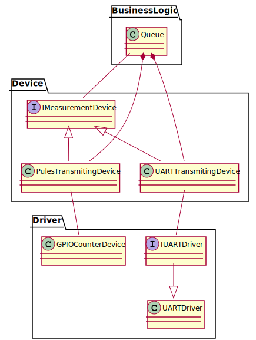

# Firmware for NUCLEO-F103RB board

## Architecture

### Diagram of measurement handling

This is the most important diagram because it shows flow of the data in the system.

### Diagram of data storage

The same interface is used for all possible storage types - UART, WiFi and SDCard.

### Draft of HMI diagram

It is not yet decided how to integrate uGFX lib here.

## Diagram of reception of data from measurement devices.

## State machine diagram

It doesn't include SDCard hotplug, reconnection to WiFi, FOTA because I don't know how this will be done.

## Credits

* Library to communicate with ST7735S LCD [following files: st7735.h, fonts.h, st7735.c, fonts.c](https://github.com/afiskon/stm32-st7735).
* Library to communicate with  SD card [following files: fatfs.h, user_diskio_spi.h, user_diskio.h, fatfs.c, user_diskio_spi.c, user_diskio.c](https://github.com/kiwih/cubemx-mmc-sd-card/).

I didn't include them as a git subtree, because it would complicate a lot a structure of the project.
