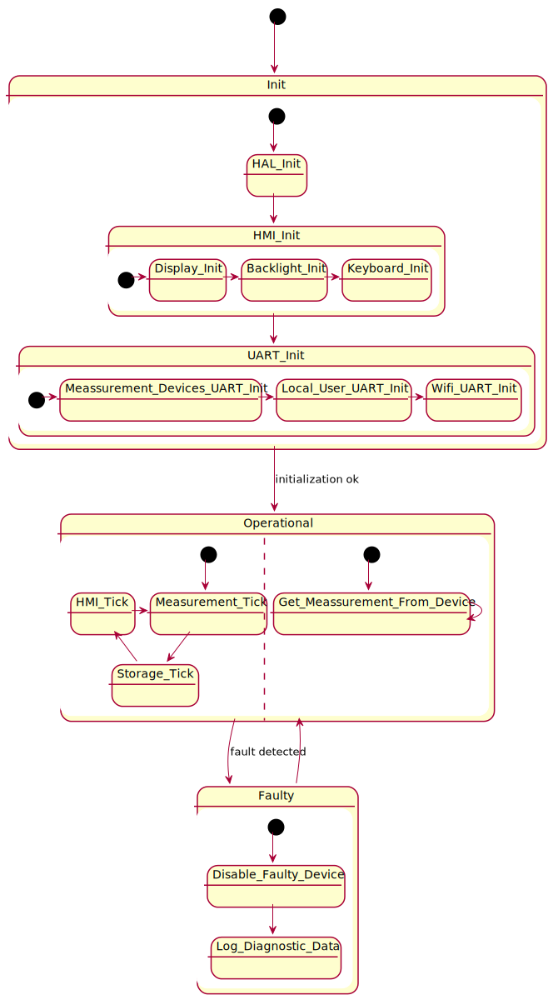
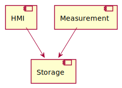
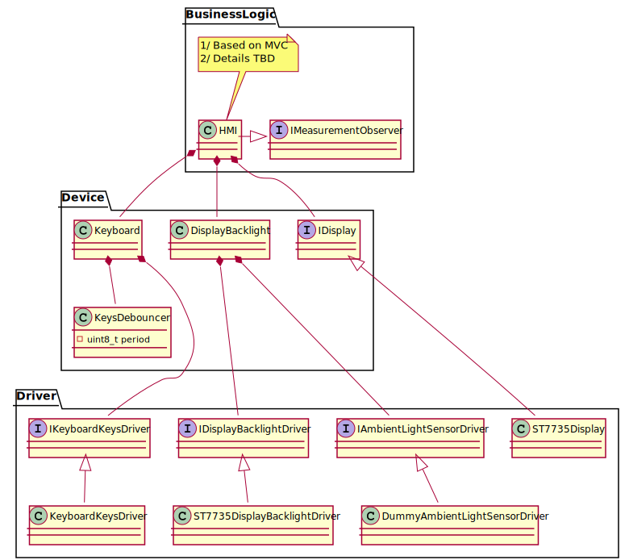

# Firmware for NUCLEO-F103RB board

## Architecture

Below is presented state machine diagram. It doesn't include SDCard hotplug, reconnection to WiFi, FOTA because I don't know how this will be done.

A very small diagram of components is presented here. I think it still is useful despite its simplicity because it shows the big picture.

Below is a diagram of data storage, the same interface is used for all possible storage types - via UART, WiFi, Bluetooth and SDCard.

Below is a draft of HMI class diagram - note the part related to what and how to present data is not yet decided.

## Credits

* Library to communicate with ST7735S LCD [following files: st7735.h, fonts.h, st7735.c, fonts.c](https://github.com/afiskon/stm32-st7735).
* Library to communicate with  SD card [following files: fatfs.h, user_diskio_spi.h, user_diskio.h, fatfs.c, user_diskio_spi.c, user_diskio.c](https://github.com/kiwih/cubemx-mmc-sd-card/).

I didn't include them as a git subtree, because it would complicate a lot a structure of the project.
