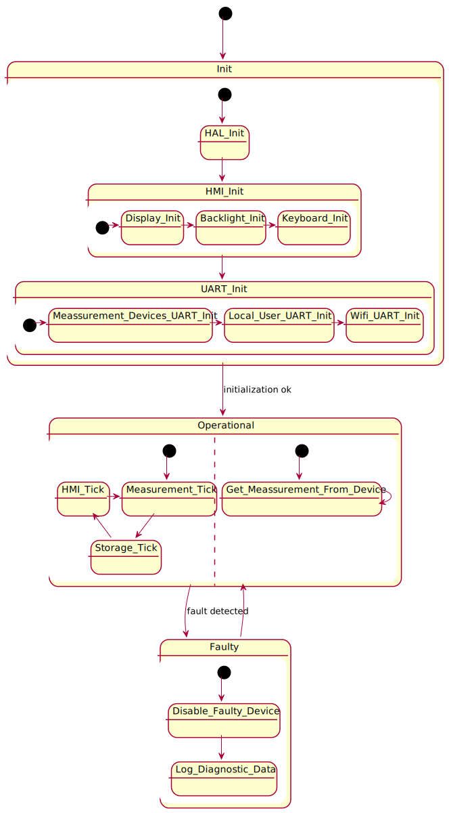

# Firmware for NUCLEO-F103RB board

The project has two build configurations:
* for generating binary, this is used for flashing, use Eclipse project
* for generating shared library, this is used for PC simulation, use Makefile

## Architecture

Below is a diagram of data storage, the same interface is used for all possible storage types - via UART, WiFi, Bluetooth and SDCard.

This is a draft of how the keyboard will  be handled.

## Credits

* Library to communicate with ST7735S LCD [following files: st7735.h, fonts.h, st7735.c, fonts.c](https://github.com/afiskon/stm32-st7735).
* Library to communicate with  SD card [following files: fatfs.h, user_diskio_spi.h, user_diskio.h, fatfs.c, user_diskio_spi.c, user_diskio.c](https://github.com/kiwih/cubemx-mmc-sd-card/).

I didn't include them as a git subtree, because it would complicate a lot a structure of the project.
