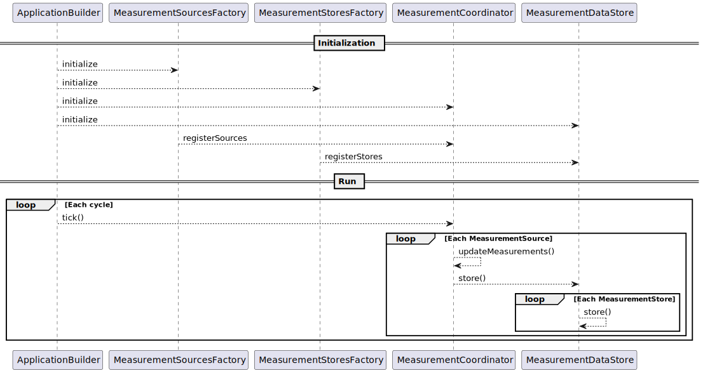
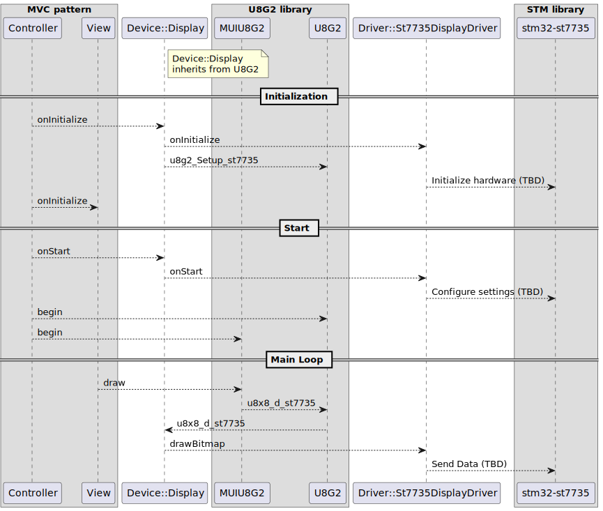

# Firmware for STM32F103RBTx

## Toolchain
* ST32CubeMX
* Visual Studio Code
* STM32 VS Code Extension
* Docker

Note: Some people argue that using STM32CubeMX is a bad idea and that everything should be coded manually. I disagree, especially for personal projects. STM32CubeMX is a great time-saver and offers a more visual way to configure the project, making it easier to understand and modify. However, the GUI can be somewhat primitive and could definitely be improve

## Setup

[Setup Manual](../../DocumePntation/Manuals/SetupFirmwareDevelopment.md)

Seting up Host machine on windows:
Go to and download and install latest version for windows
https://developer.arm.com/downloads/-/arm-gnu-toolchain-downloads
Open VS Code and install these extensions (press Ctrl+Shift+X to open Extensions):

C/C++ (by Microsoft) - Essential
CMake Tools (by Microsoft) - For CMake integration
CMake (by twxs) - Syntax highlighting for CMake files
Cortex-Debug (by marus25) - For debugging STM32 (optional but recommended)

Remove this system variable %STM32CLT_PATH%\GNU-tools-for-STM32\bin from PATH

## Architecture

Measurement flow diagram

Sequence diagram of the display.

## Third party libraries used

* [MUI](https://github.com/olikraus/u8g2/wiki/muimanual)
* [u8g2](https://github.com/olikraus/u8g2)
* ST7735S LCD [STMicroelectronics/stm32-st7735](https://github.com/STMicroelectronics/stm32-st7735).

